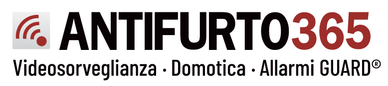

# iAlarmXR&trade; (Antifurto365&reg;) integration for Home Assistant

[![GitHub Release][releases-shield]][releases]
![Project Stage][project-stage-shield]
[![License][license-shield]](LICENSE.md)

![Maintenance][maintenance-shield]
[![GitHub Activity][commits-shield]][commits]

 

A simple library to interface for iAlarmXR&trade; systems, built for use with Home Assistant.

##
** "iAlarmXR" is a trademark of Antifurto365&reg;.

[releases-shield]: https://img.shields.io/github/release/bigmoby/pyialarmxr.svg
[releases]: https://github.com/bigmoby/pyialarmxr/releases
[project-stage-shield]: https://img.shields.io/badge/project%20stage-development-yellowgreen.svg
[license-shield]: https://img.shields.io/github/license/bigmoby/pyialarmxr
[maintenance-shield]: https://img.shields.io/maintenance/yes/2022.svg
[commits-shield]: https://img.shields.io/github/commit-activity/y/bigmoby/pyialarmxr.svg
[commits]: https://img.shields.io/github/commits/bigmoby/pyialarmxr